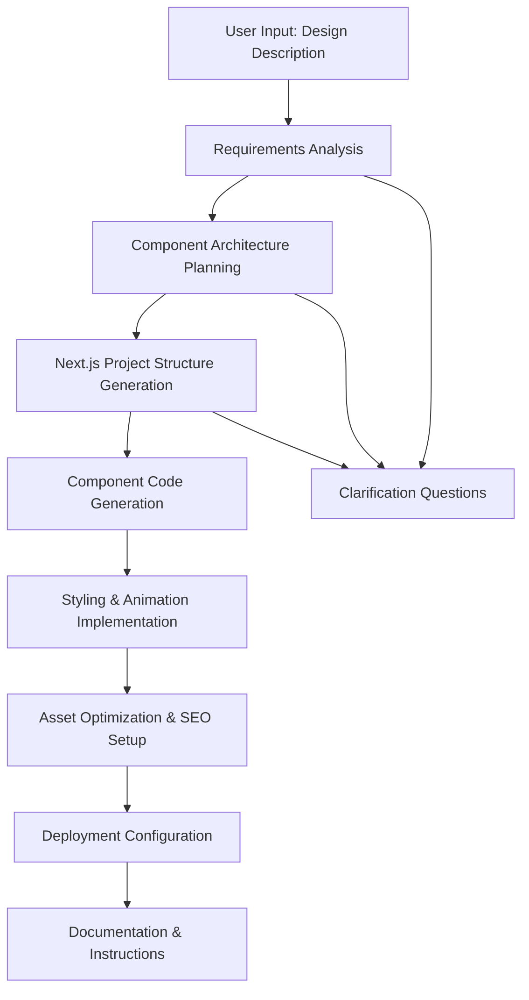

# 🧠 Product Requirements Prompt (PRP): Website Builder Agent

## 📌 Project Title:
Website Builder Agent - AI-Powered Website Generation System

## 🎯 Primary Objective
Build an autonomous AI agent that generates complete, modern websites based on user prompts, brand inputs, or structured content. The agent combines advanced design knowledge with production-ready frontend code output, following best practices in modular design, responsiveness, accessibility, and UX flow.

## 🧪 Success Criteria
- [x] Accept high-level design descriptions and translate them into a full website
- [x] Generate components, sections, pages, routes, and visual styles
- [x] Implement modern UI principles using TailwindCSS, Next.js, and Framer Motion
- [x] Package results into a clean, editable file structure for developers or clients
- [ ] Generate deployable Next.js 14+ applications with App Router
- [ ] Create responsive layouts for mobile, tablet, and desktop
- [ ] Implement modular components with reusable UI patterns
- [ ] Ensure type safety with TypeScript and proper validation
- [ ] Include comprehensive accessibility features (ARIA labels, semantic HTML)
- [ ] Generate optimized assets with next/image and WebP support
- [ ] Create Vercel-ready deployment configurations

## ⚙️ Core Functionality
- Parse natural language descriptions into structured website requirements
- Generate complete Next.js application structure with proper routing
- Create responsive, animated components using TailwindCSS and Framer Motion
- Implement modern design patterns and accessibility standards
- Generate optimized assets and meta tags for SEO
- Provide clean, maintainable code with proper TypeScript types
- Include comprehensive documentation and setup instructions

## 🔄 Workflow & Flowchart


## 📁 Files & Modules
- `src/website_builder_agent.py`: Main agent with website generation logic
- `src/prompts/website_analysis_prompt.txt`: AI prompt for requirements analysis
- `src/prompts/component_generation_prompt.txt`: AI prompt for component creation
- `src/prompts/styling_prompt.txt`: AI prompt for TailwindCSS styling
- `src/templates/nextjs_base/`: Base Next.js project template
- `src/templates/components/`: Reusable component templates
- `src/utils/code_generator.py`: Code generation utilities
- `src/utils/asset_optimizer.py`: Image and asset optimization
- `src/models/website_models.py`: Pydantic models for website structures
- `tests/test_website_builder.py`: Unit tests for generation logic
- `tests/test_component_generation.py`: Component generation tests

## 🔐 Auth & Permissions
- OpenAI API key for AI-powered generation
- Optional: GitHub API for repository creation
- Optional: Vercel API for direct deployment
- File system permissions for project generation

## 📦 Dependencies & APIs
- **OpenAI API**: https://platform.openai.com/docs/ for AI generation
- **Next.js 14+**: https://nextjs.org/docs for React framework
- **TailwindCSS**: https://tailwindcss.com/docs for styling
- **Framer Motion**: https://www.framer.com/motion/ for animations
- **TypeScript**: https://www.typescriptlang.org/docs/ for type safety
- **Pydantic**: For data validation and serialization
- **Jinja2**: For template rendering and code generation

## 🧪 Test Plan
- [ ] Unit tests for component generation logic
- [ ] Integration tests for full website generation
- [ ] Accessibility tests for generated components
- [ ] Responsive design validation tests
- [ ] Performance tests for generated websites
- [ ] SEO optimization validation tests
- [ ] Cross-browser compatibility tests

## 📝 Notes & Assumptions
- Using OpenAI GPT-4 for best code generation quality
- All generated websites follow Next.js 14+ App Router patterns
- TailwindCSS is the primary styling framework
- Framer Motion handles all animations and interactions
- Generated code must be production-ready and deployable
- TypeScript is used for all component definitions

## 💡 Reference Docs
- **Next.js Documentation**: https://nextjs.org/docs
- **TailwindCSS Documentation**: https://tailwindcss.com/docs
- **Framer Motion Documentation**: https://www.framer.com/motion/
- **OpenAI API**: https://platform.openai.com/docs/
- **TypeScript Handbook**: https://www.typescriptlang.org/docs/

---

## 🔍 Feature Overview
The Website Builder Agent is an intelligent AI system designed to transform natural language descriptions into complete, production-ready websites. It leverages advanced AI models to understand design requirements, generate appropriate component architectures, and produce clean, maintainable code that follows modern web development best practices.

### Use Cases
- **Rapid Prototyping**: Quickly generate website prototypes from design descriptions
- **Client Presentations**: Create professional websites for client demonstrations
- **Landing Page Generation**: Build optimized landing pages for marketing campaigns
- **Portfolio Websites**: Generate personal or business portfolio sites
- **E-commerce Sites**: Create product showcase and shopping experiences
- **Blog Platforms**: Build content-focused websites with proper SEO

### Constraints
- Must generate valid Next.js 14+ code with App Router
- All components must be responsive and accessible
- Generated code must follow TypeScript best practices
- Performance optimization is required (lazy loading, image optimization)
- SEO best practices must be implemented

## ✅ Success Criteria
- **Functional Requirements**:
  - Successfully generates deployable Next.js applications
  - Creates responsive layouts for all device sizes
  - Implements proper accessibility features (ARIA, semantic HTML)
  - Generates optimized assets and meta tags
  - Provides clean, maintainable TypeScript code

- **Non-Functional Requirements**:
  - Generation time < 30 seconds for standard websites
  - Generated sites load in < 3 seconds on 3G connections
  - Lighthouse performance score > 90
  - Accessibility score > 95
  - SEO score > 90

## 🧠 Architectural Strategy

### Suggested File Structure
```
src/
├── __init__.py
├── website_builder_agent.py        # Main agent implementation
├── prompts/
│   ├── website_analysis_prompt.txt
│   ├── component_generation_prompt.txt
│   ├── styling_prompt.txt
│   └── seo_prompt.txt
├── templates/
│   ├── nextjs_base/               # Base Next.js template
│   │   ├── app/
│   │   ├── components/
│   │   ├── styles/
│   │   └── public/
│   └── components/                # Component templates
│       ├── hero/
│       ├── navigation/
│       ├── features/
│       └── footer/
├── models/
│   ├── __init__.py
│   └── website_models.py          # Pydantic data models
├── utils/
│   ├── __init__.py
│   ├── code_generator.py          # Code generation utilities
│   ├── asset_optimizer.py         # Asset optimization
│   └── validation.py              # Input validation
└── config/
    ├── __init__.py
    └── settings.py                # Environment config

tests/
├── __init__.py
├── test_website_builder.py        # Unit tests
├── test_component_generation.py   # Component tests
└── fixtures/
    ├── sample_websites/           # Test website samples
    └── component_templates/       # Test component templates
```

### Recommended Frameworks/Libraries
- **Next.js 14+**: Modern React framework with App Router
- **TailwindCSS**: Utility-first CSS framework
- **Framer Motion**: Animation library for React
- **TypeScript**: Type-safe JavaScript
- **OpenAI**: AI-powered code generation
- **Pydantic**: Data validation and serialization
- **Jinja2**: Template rendering engine

### Reusable Components
- **Component Templates**: Reusable React component patterns
- **Styling Templates**: TailwindCSS utility patterns
- **Animation Templates**: Framer Motion animation patterns
- **SEO Templates**: Meta tag and structured data patterns
- **Accessibility Templates**: ARIA and semantic HTML patterns

## 🔄 API & Tooling Dependencies

### External APIs
- **OpenAI API**:
  - URL: `https://api.openai.com/v1/chat/completions`
  - Usage: Website analysis, component generation, styling
  - Rate Limits: Based on OpenAI plan
  - Authentication: API key in headers

- **Optional: GitHub API**:
  - URL: `https://api.github.com/`
  - Usage: Repository creation and code push
  - Rate Limits: 5000 requests/hour for authenticated users
  - Authentication: Personal access token

- **Optional: Vercel API**:
  - URL: `https://vercel.com/docs/rest-api`
  - Usage: Direct deployment to Vercel
  - Rate Limits: Based on Vercel plan
  - Authentication: API token

### Data Models
```python
# Website requirements analysis
class WebsiteRequirements(BaseModel):
    purpose: str = Field(..., description="Website purpose and goals")
    target_audience: str = Field(..., description="Target audience description")
    design_style: str = Field(..., description="Design style preferences")
    color_scheme: Optional[str] = Field(None, description="Color preferences")
    features: List[str] = Field(default_factory=list, description="Required features")
    pages: List[str] = Field(default_factory=list, description="Required pages")

# Component specification
class ComponentSpec(BaseModel):
    name: str = Field(..., description="Component name")
    type: str = Field(..., description="Component type (hero, nav, footer, etc.)")
    props: Dict[str, Any] = Field(default_factory=dict, description="Component props")
    styling: Dict[str, Any] = Field(default_factory=dict, description="Styling options")
    animations: List[str] = Field(default_factory=list, description="Animation types")

# Generated website structure
class WebsiteStructure(BaseModel):
    name: str = Field(..., description="Website name")
    pages: List[str] = Field(..., description="List of pages")
    components: List[ComponentSpec] = Field(..., description="Component specifications")
    styling: Dict[str, Any] = Field(..., description="Global styling configuration")
    seo: Dict[str, Any] = Field(..., description="SEO configuration")
    deployment: Dict[str, Any] = Field(..., description="Deployment configuration")
```

### Authentication Setup
- **OpenAI API**: Set API key in environment variables
- **GitHub API**: Configure personal access token for repository creation
- **Vercel API**: Set API token for direct deployment
- **File System**: Ensure write permissions for project generation

## 🔧 Engineering Plan

### Step-by-Step Implementation

**Phase 1: Core Infrastructure (Week 1)**
1. Set up project structure and dependencies
2. Create Pydantic models for website data structures
3. Implement base Next.js template system
4. Add component template generation utilities
5. Create configuration management with environment variables

**Phase 2: AI Integration (Week 2)**
1. Implement website requirements analysis using OpenAI API
2. Create component generation logic with custom prompts
3. Add styling generation using TailwindCSS patterns
4. Implement SEO optimization and meta tag generation
5. Add error handling for AI API failures

**Phase 3: Code Generation (Week 3)**
1. Build code generation utilities for Next.js components
2. Implement template rendering with Jinja2
3. Add TypeScript type generation
4. Create asset optimization and image handling
5. Implement responsive design generation

**Phase 4: Testing & Validation (Week 4)**
1. Write unit tests for all generation functions
2. Create integration tests for full website generation
3. Add accessibility validation tests
4. Implement performance testing for generated sites
5. Add deployment configuration generation

**Phase 5: Production Readiness (Week 5)**
1. Add comprehensive documentation
2. Implement monitoring and logging
3. Create deployment automation
4. Add health check endpoints
5. Final testing and optimization

### Validation Checkpoints
- **Syntax & Style**: Run `eslint` and `prettier` on generated code
- **TypeScript**: Ensure `tsc --noEmit` passes
- **Build Tests**: Verify `npm run build` succeeds
- **Performance Tests**: Run Lighthouse audits
- **Accessibility Tests**: Validate with axe-core
- **Responsive Tests**: Test on multiple device sizes

### Integration Points
- **Version Control**: Optional GitHub repository creation
- **Deployment**: Optional Vercel deployment automation
- **Monitoring**: Track generation success rates and performance
- **Analytics**: Monitor generated website performance

## 🧠 Context Linking

### Files to Reference During Implementation
- `use-cases/pydantic-ai/examples/main_agent_reference/`: Best practices for Pydantic AI agents
- `use-cases/pydantic-ai/examples/main_agent_reference/models.py`: Data model patterns
- `use-cases/pydantic-ai/examples/main_agent_reference/tools.py`: Tool implementation patterns
- `PRPs/templates/prp_base.md`: Base PRP template for validation patterns

### Relevant Documentation
- **Pydantic AI Documentation**: https://ai.pydantic.dev/
- **Next.js Documentation**: https://nextjs.org/docs
- **TailwindCSS Documentation**: https://tailwindcss.com/docs
- **Framer Motion Documentation**: https://www.framer.com/motion/
- **OpenAI API Reference**: https://platform.openai.com/docs/api-reference

### Examples to Study
- Next.js project structures and patterns
- React component best practices
- TailwindCSS utility patterns
- Framer Motion animation examples
- SEO and accessibility implementations

---

## Anti-Patterns to Avoid
- ❌ Don't generate monolithic components - use modular patterns
- ❌ Don't skip TypeScript types - ensure type safety
- ❌ Don't ignore accessibility - implement ARIA and semantic HTML
- ❌ Don't generate unoptimized images - use next/image
- ❌ Don't skip responsive design - test all breakpoints
- ❌ Don't ignore SEO - implement proper meta tags
- ❌ Don't generate blocking code - use async patterns
- ❌ Don't skip error handling - validate all inputs

## Final Validation Checklist
- [ ] All tests pass: `pytest tests/ -v`
- [ ] Generated code builds: `npm run build`
- [ ] TypeScript validation: `tsc --noEmit`
- [ ] ESLint passes: `npm run lint`
- [ ] Accessibility score > 95: Lighthouse audit
- [ ] Performance score > 90: Lighthouse audit
- [ ] SEO score > 90: Lighthouse audit
- [ ] Responsive design works: Test all breakpoints
- [ ] Documentation complete: README and setup instructions
- [ ] Deployment ready: Vercel configuration included
