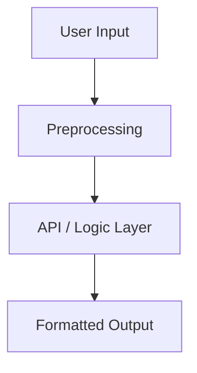

# 🧠 Product Requirements Prompt (PRP) Template

## 📌 Project Title:
> e.g. "Smart Email Parser for Lead Scoring"

## 🎯 Primary Objective
Clearly define the problem this feature solves and what the final outcome should accomplish.

## 🧪 Success Criteria
- [ ] Measurable outcomes (speed, accuracy, UX)
- [ ] Defined endpoints or interfaces
- [ ] Passes specific test cases

## ⚙️ Core Functionality
Break down the main components of the system:
- Input types
- Data processing or transformation
- Output expectations

## 🔄 Workflow & Flowchart
Describe key flow from user to API to response:

## 📁 Files & Modules
List the files and their responsibilities:
- `parser.ts`: input validation and cleaning
- `score.ts`: AI scoring logic
- `api/email.ts`: endpoint for incoming data

## 🔐 Auth & Permissions
Does this require user login or admin access?

## 📦 Dependencies & APIs
Mention any external APIs or libraries:
- OpenAI API
- Resend Email API
- Zod for validation

## 🧪 Test Plan
- [ ] Unit tests for all major functions
- [ ] Edge case inputs
- [ ] Invalid/malformed input handling

## 📝 Notes & Assumptions
- Input is always structured HTML
- Scores returned are floats between 0–1

## 💡 Reference Docs
- Link to similar example in `/examples/`
- API docs: https://platform.openai.com/docs/
